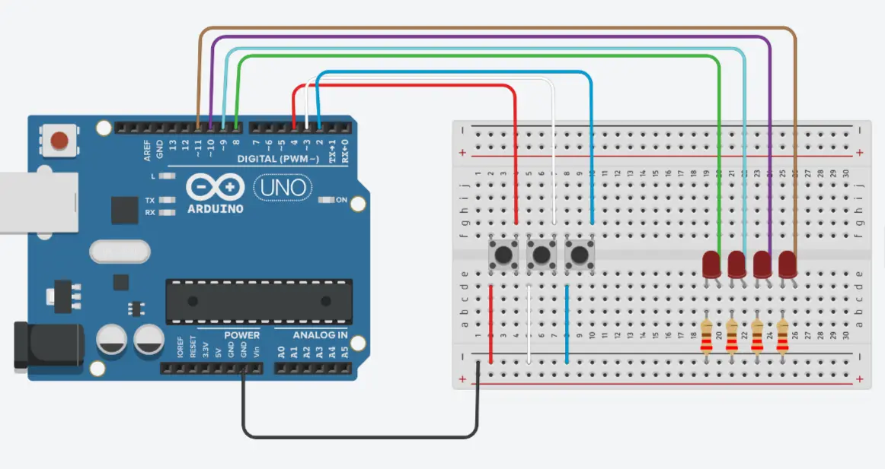

# Super-Bit-Smasher

This repository is a project that I had to do in my University course called Tecnologia da Informática (Computer Technology).

Because this was made in a Portuguese University, the code, variable names and comments are all in Portuguese.

## How to setup the game

Copy the following diagram. You will need:
- 1 Arduino Uno
- 1 breadboard
- 3 buttons
- 4 LEDs
- 4 220 ohm resistors
- 11 cables

  

## How the game works

When you upload the [superBitSmasher.ino](https://github.com/TomAintAround/SuperBitSmasher/blob/main/superBitSmasher/superBitSmasher.ino) file to the Arduino, you will be given a target and a base value and through bitwise operations, you need to transform the base value into the target value. To do that, you need to insert a number and a bitwise operation through 1 of the 3 buttons: AND, OR and XOR, but there's a catch: while the OR button is always available to be used, the AND button can only be used when bit 1 (second to last) is on, while the XOR is the opposite.

There is also a timer that lasts 30 seconds. It will reset once it reaches the limit (making the player) lose or when the player whens, when the target and base values are the same. The 4 LEDs indicate at what stage the timer is.

You can also reset the game back by pressing the OR button for 2 seconds.
